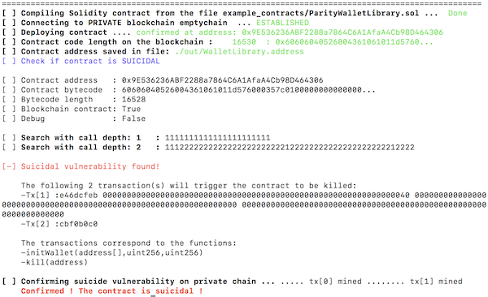
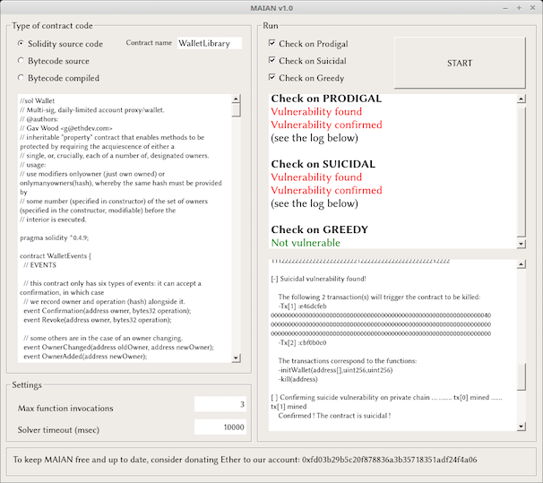

# Maian 

The repository contains Python implementation of Maian -- a tool for automatic detection of buggy Ethereum smart contracts of three different types: prodigal, suicidal and greedy. Maian processes contract's bytecode and tries to build a trace of transactions to find and confirm bugs. The technical aspects of the approach are described in [our paper](https://arxiv.org/abs/1802.06038). 

## Evaluating Contracts
Maian analyzes smart contracts defined in a file `<contract file>` with:  

1. Solidity source code, use `-s <contract file> <main contract name>`
2. Bytecode source, use `-bs <contract file>`
3. Bytecode compiled (i.e. the code sitting on the blockchain), use `-b <contract file>`

Maian checks for three types of buggy contracts:

1. Suicidal contracts (can be killed by anyone, like the Parity Wallet Library contract), use `-c 0`
2. Prodigal contracts (can send Ether to anyone), use `-c 1`
3. Greedy contracts (nobody can get out Ether), use `-c 2`

For instance, to check if the contract `ParityWalletLibrary.sol` given in Solidity source code with `WalletLibrary` as main contract is suicidal use

	$ python maian.py -s ParityWalletLibrary.sol WalletLibrary -c 0

The output should look like this:

To get the full list of options use `python maian.py -h`

### GUI

For GUI inclined audience, we provide  a simple GUI-based Maian. Use `python gui-maian.py` to start it. 
A snapshot of one run is given below

## Supported Operating Systems and Dependencies

Maian should run smoothly on Linux (we've checked on Ubuntu/Mint) and MacOS. Our attempts to run it on Windows have failed. 
The list of dependencies is as follows:

1. Go Ethereum, check https://ethereum.github.io/go-ethereum/install/
2. Solidity compiler, check http://solidity.readthedocs.io/en/develop/installing-solidity.html
3. Z3 Theorem prover, check https://github.com/Z3Prover/z3
4. web3, try `pip install web3`
5. PyQt5 (only for GUI Maian), try `sudo apt install python-pyqt5` 

## Important

To reduce the number of false positives, Maian deploys the analyzed contracts (given either as Solidity or bytecode source) on 
a private blockchain, and confirms the found bugs by sending appropriate transactions to the contracts. 
Therefore, during the execution of the tool, a private Ethereum blockchain is running in the background (blocks are mined on it in the same way as on the Mainnet). Our code stops the private blockchain once Maian finishes the search, however, in some  extreme cases, the blockchain keeps running. Please make sure that after the execution of the program, the private blockchain is off (i.e. `top` does not have `geth` task that corresponds to the private blockchain). 

## License

Maian is released under the [MIT License](https://opensource.org/licenses/MIT), i.e. free for private and commercial use.

## Donations

To help keep this and other future tools free and up to date, consider donating Ether to our account: 0xfd03b29b5c20f878836a3b35718351adf24f4a06
 